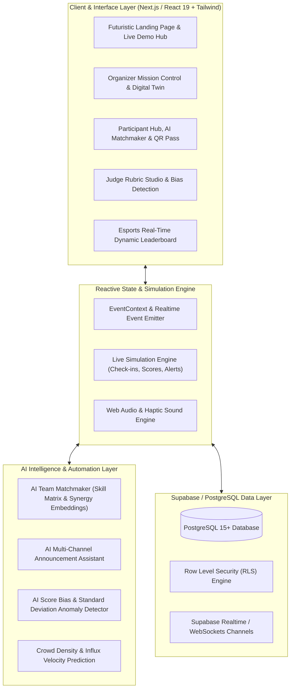

# EventOS AI - System Architecture & User Flow Specification

## User Flows

### 1. Organizer Flow
1. **Launch Mission Control**: View real-time digital twin venue occupancy, crowd arrival velocity, and active hacking teams.
2. **AI Multi-Channel Broadcast**: Type rough intent -> AI generates Push, SMS, Email, and Discord messages -> 1-click broadcast to 500+ participants.
3. **QR Check-in Station**: Use integrated camera/simulator to validate participant passes and instantly update room capacity.
4. **Judging Supervision**: Monitor real-time judge scoring pace, track completion rates, and view AI bias alerts.

### 2. Participant Flow
1. **Access Digital Passport**: View holographic dynamic QR pass with verified check-in status.
2. **AI Team Formation**:
   - Set skills (e.g., Rust, React, PyTorch, UX Design) and preferred role.
   - AI computes synergy scores (>95%) and generates dream team recommendations.
   - One-click join/invite actions.
3. **Timeline & Gamification**: Track hackathon milestones, earn XP points, and unlock achievements.
4. **Project Submission**: Submit repo links, demo video, tech stack, and trigger AI auto-summary.

### 3. Judge Flow
1. **Assigned Project Queue**: Filter submissions by track and evaluation status.
2. **Smart Rubric Evaluation**: Score across 4 weighted pillars (Technical Complexity, Innovation, Design & UX, Impact).
3. **AI Bias Validation**: Real-time validation checks for outlier variance compared to historical distributions.
4. **Live Leaderboard Sync**: Scores trigger automated recalculation and instantaneous rank animations.
